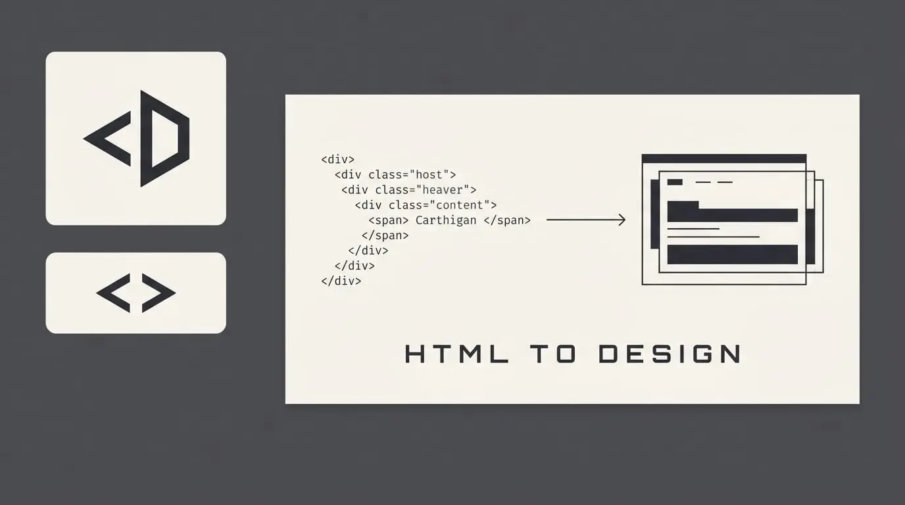

# HTML-TO-DESIGN

Converts a coded prototype or landing page into a Penpot design file for iteration
- Imports HTML email templates into Penpot for visual editing
- Turns Tailwind CSS component libraries into reusable Penpot design assets
- Brings an existing website section into Penpot to redesign or annotate it
- Converts AI-generated HTML (from ChatGPT, Claude, v0) directly into editable design layers
- Bridges the gap between developers and designers by going from code back to design
- Quickly mock up design variations starting from a working HTML reference.

## Roadmap
- Documentation
  - Document the current features of the plugin
  - Document the current spec of the conversion
    - Which html element are supported
    - Which css feature are supported
  - Deffine mapping between penpot feature and css feature
- Core
  - Add support for different naming scheme
  - Add support for using component
  - Add support for using design token
  - Add support for using
- IFrame
  - Add configuration panel
  - Add theme selection
  - Add rich text editor
- Plugin
  - Add unit test for parser 
  - Add unit test for converter
  - Add support for grid
